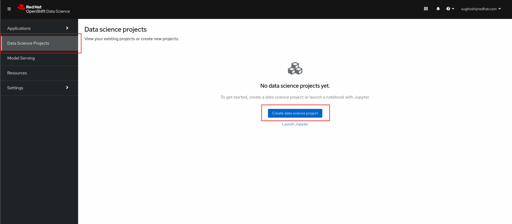
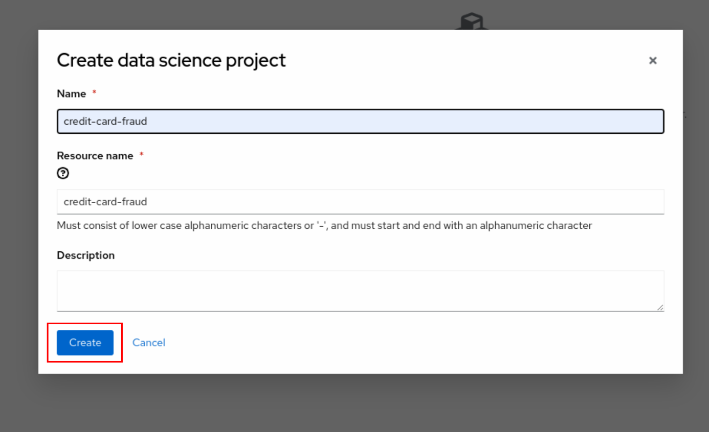
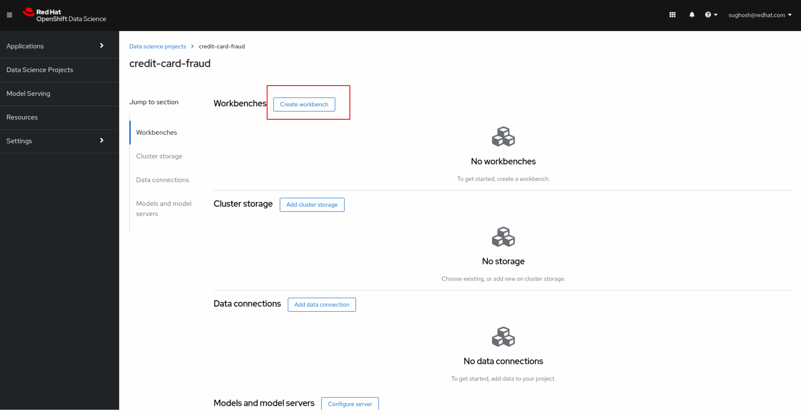
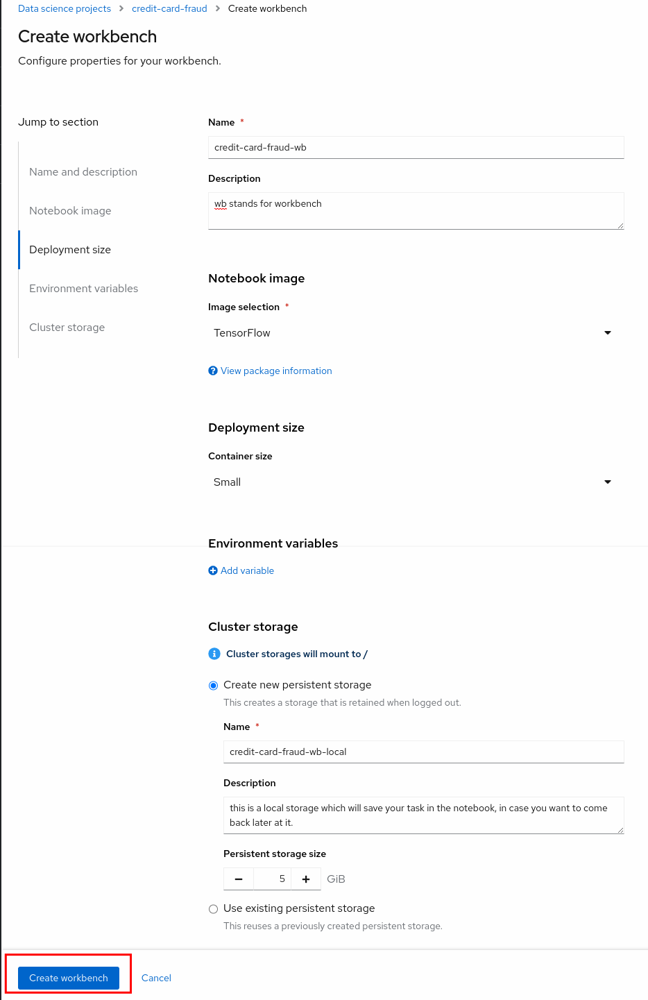
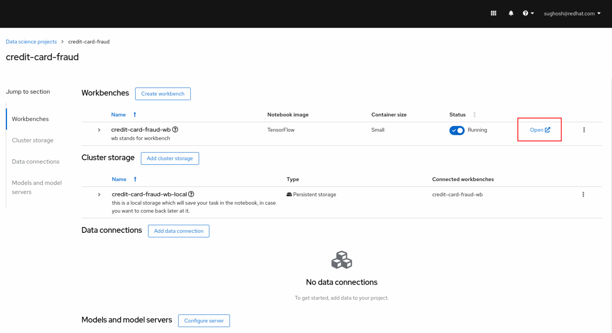
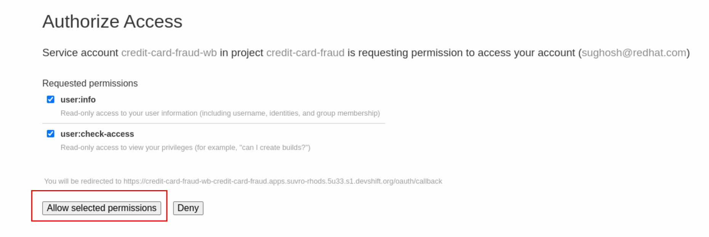
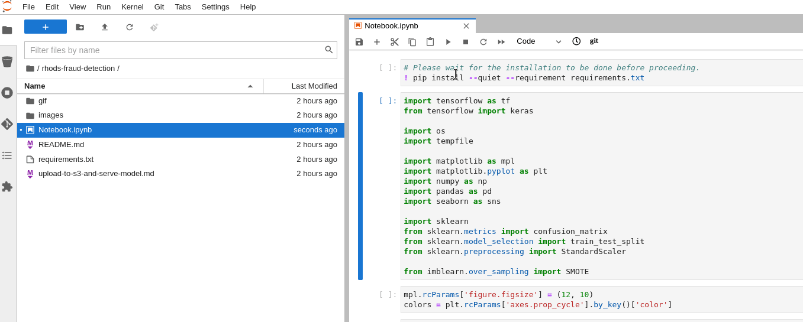

# Fraud Detection with Red Hat OpenShift Data Science
Red Hat OpenShift Data Science is a managed cloud service for data scientists
and developers of intelligent applications. It provides a fully supported
environment in which to rapidly develop, train, and test machine learning (ML)
models in the public cloud before deploying in production.

The content in this repository describes how to use OpenShift Data Science to
train and test a relatively simplistic fraud detection model. In exploring this
content, you will become familiar with the OpenShift Data Science offering and
common workflows to use with it. This repo uses RHODS ModelMesh to deploy the
model which uses OpenVino Model Server (OVMS) under the hood.

## Access OpenShift Data Science
In order to use the content in this repository, you need to already have access
to an OpenShift Data Science environment. If that is not the case, you can sign-up for a free 30-days "sandbox" environment by going to the [sandbox URL](https://red.ht/rhods-sandbox) and signing up.
If you are using the "sandbox" environment, some instructions will differ slightly, but they will be explicitly stated when that is the case. 

Using the access credentials provided
to you, log into the OpenShift Data Science portal by following the _ODS
Dashboard_ link. 

Use the `Username` and `Password` details you were provided. When you see the
**Authorize Access** page, click the _Allow selected permissions_ button. These
permissions are allowing the ODH Dashboard application to interact with the
cluster as if it were your user (for the purpose of automations). This is a
common paradigm with OpenShift and Kubernetes.

### Step 1: Create Data science project
We can either Launch Jupyter notebook or create a Data science (DS) project which in turn would use Jupyter notebook. Here we will create a DS project just to keep different projects organised along with their resources.



Create a project with a name of your choice. here we will use `credit-card-fraud` as the name.


### Step 2: Create a workbench 
We will create a workbench within our `credit-card-fraud` DS project. This workbench will internally create a Jupyter notebook for us to play with.


- we would use the workbench name as `credit-card-fraud-wb`
- Ensure that `TensorFlow` is selected for the Notebook image since our example uses those packages.
- Container size would depend on available resources in the cluster and the need of the notebook, we will choose `small` that should suffice our needs.
- (scroll) Create new persistent storage with the name `credit-card-fraud-wb-local`
- Persistent storage size `5Gi`

click _Create workbench_.


Give it a minute, it will create the workbench for you. Once created click _open_

Login and click _Allow selected permissions_

### Clone Git Repository
Once your notebook container is launched, at the left-hand side of the notebook console is a Git icon. 


Click the Git icon and then click _Clone a Repository_. 

In the window that pops up, copy the Git URL for this repository and paste it into the box:

```
https://github.com/RHEcosystemAppEng/rhods-fraud-detection
```

Then, click _CLONE_.

In the file browser, you will now see a folder for the repository that was cloned.


### Open the Notebook
At this point you should double-click on the `rhods-fraud-detection` folder in
the file explorer, and then double-click on the [Notebook.ipynb](./Notebook.ipynb)
notebook file. Begin to follow the instructions in that notebook.

