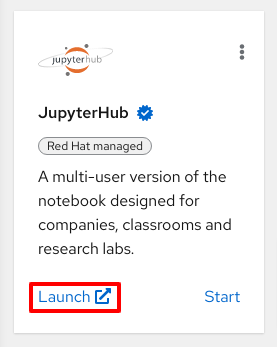
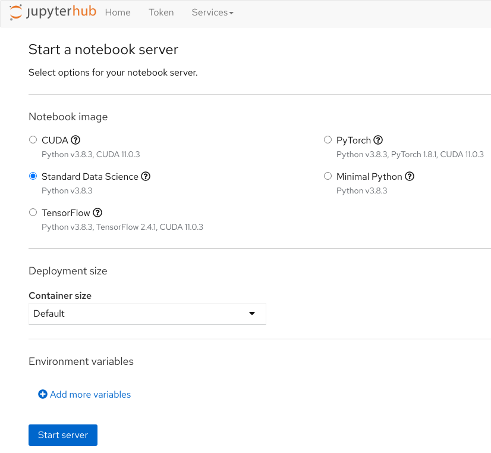
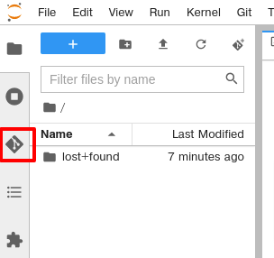
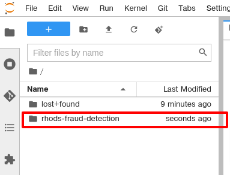

# Fraud Detection with Red Hat OpenShift 
Red Hat OpenShift is an enterprise ready Kubernetes platform used to host
cloud native tools and applications for data scientists. It provides an
environment to rapidly develop, train, test and monitor machine learning (ML)
models in production.

The content in this repository describes how OpenShift can support an end to end data science workflow
using a synthetic fraud detection data and model. In exploring this
content, you will become familiar with several open source frameworks and tools to support 
data science workflows.

## What's needed to participate.

A web browser with internet access

### An Openshift cluster

A login will be provided.
 
### Launch Jupyter Hub
OpenShift Data Science makes extensive use of Jupter Hub, a project that enables
users to quickly and easily launch Jupyter Notebooks to conduct data and feature
engineering, experimentation, model training, and testing.



From the OpenShift Data Science Dashboard page, click the Jupyter Hub link. Use the
same credentials that you used to access the OpenShift Data Science portal. Each
application has its own `Service Account` for interacting with OpenShift, so
they all need authorization acess.

## Launch a Notebook
When you first access Jupyter Hub, you will see a configuration screen that asks
you which notebook image to use as the base for your project, as well as for
some other details. 

1. Ensure that **Standard Data Science** is selected for the
notebook image. You may not see any other images listed, and that's OK. Just make sure to select **Standard Data Science**.

2. Make sure that you change the container size to **SMALL**. If you do not change it, your lab will for sure blow up between notebooks 2 and 3, or many other times. You need more memory for your lab, so be sure to choose **SMALL**. The default size does not have enough memory. Do not choose larger sizes, as you will likely either fail to ever get a lab notebook, or you will interrupt the other user's experiences.

Once you have made the correct selections indicated above, click _Start Server_.



## Clone Git Repository
Once your notebook container is launched, at the left-hand side of the notebook console is a Git icon. 



Click the Git icon and then click _Clone a Repository_. 

In the window that pops up, copy the Git URL for this repository and paste it into the box:

```
https://github.com/redhat-na-ssa/fraud-detection-workshop.git
```

Then, click _CLONE_.

In the file browser, you will now see a folder for the repository that was cloned.



## Open the Notebook
At this point you should double-click on the `rhods-fraud-detection` folder in
the file explorer, and then double-click on the `00-getting-started.ipynb`
notebook file. Begin to follow the instructions in that notebook.
