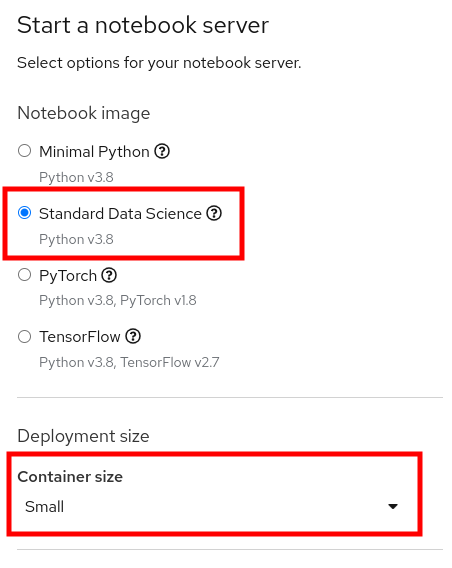

# Fraud Detection with Red Hat OpenShift Data Science
Red Hat OpenShift Data Science is a managed cloud service for data scientists
and developers of intelligent applications. It provides a fully supported
environment in which to rapidly develop, train, and test machine learning (ML)
models in the public cloud before deploying in production.

The content in this repository describes how to use OpenShift Data Science to
train and test a relatively simplistic fraud detection model. In exploring this
content, you will become familiar with the OpenShift Data Science offering and
common workflows to use with it.

## Access OpenShift Data Science
In order to use the content in this repository, you need to already have access
to an OpenShift Data Science environment. If that is not the case, you can sign-up for a free 30-days "sandbox" environment by going to the [sandbox URL](https://red.ht/rhods-sandbox) and signing up.
If you are using the "sandbox" environment, some of the instructions will differ slightly, but they will be explicitely stated when that is the case. 

Using the access credentials provided
to you, log into the OpenShift Data Science portal by following the _ODS
Dashboard_ link. 

Use the `Username` and `Password` details you were provided. When you see the
**Authorize Access** page, click the _Allow selected permissions_ button. These
permissions are allowing the ODH Dashboard application to interact with the
cluster as if it were your user (for the purpose of automations). This is a
common paradigm with OpenShift and Kubernetes.

## Launch Jupyter Hub
OpenShift Data Science makes extensive use of Jupter Hub, a project that enables
users to quickly and easily launch Jupyter Notebooks to conduct data and feature
engineering, experimentation, model training, and testing.


From the OpenShift Data Science Dashboard page, click the Jupyter Hub link. Use the
same credentials that you used to access the OpenShift Data Science portal. Each
application has its own `Service Account` for interacting with OpenShift, so
they all need authorization acess.

## Launch a Notebook
When you first access Jupyter Hub, you will see a configuration screen that asks
you which notebook image to use as the base for your project, as well as for
some other details. 

1. Ensure that **Standard Data Science** is selected for the
notebook image. You may not see any other images listed, and that's OK. Just make sure to select **Standard Data Science**.

2. Make sure that you change the container size to **SMALL**. If you do not change it, your lab will for sure blow up between notebooks 2 and 3, or many other times. You need more memory for your lab, so be sure to choose **SMALL**. The default size does not have enough memory. Do not choose larger sizes, as you will likely either fail to ever get a lab notebook, or you will interrupt the other user's experiences.

Once you have made the correct selections indicated above, click _Start Server_.



## Clone Git Repository
Once your notebook container is launched, at the left-hand side of the notebook console is a Git icon. 


Click the Git icon and then click _Clone a Repository_. 

In the window that pops up, copy the Git URL for this repository and paste it into the box:

```
https://github.com/OpenShiftDemos/rhods-fraud-detection.git
```

Then, click _CLONE_.

In the file browser, you will now see a folder for the repository that was cloned.


## Open the Notebook
At this point you should double-click on the `rhods-fraud-detection` folder in
the file explorer, and then double-click on the `00-getting-started.ipynb`
notebook file. Begin to follow the instructions in that notebook.