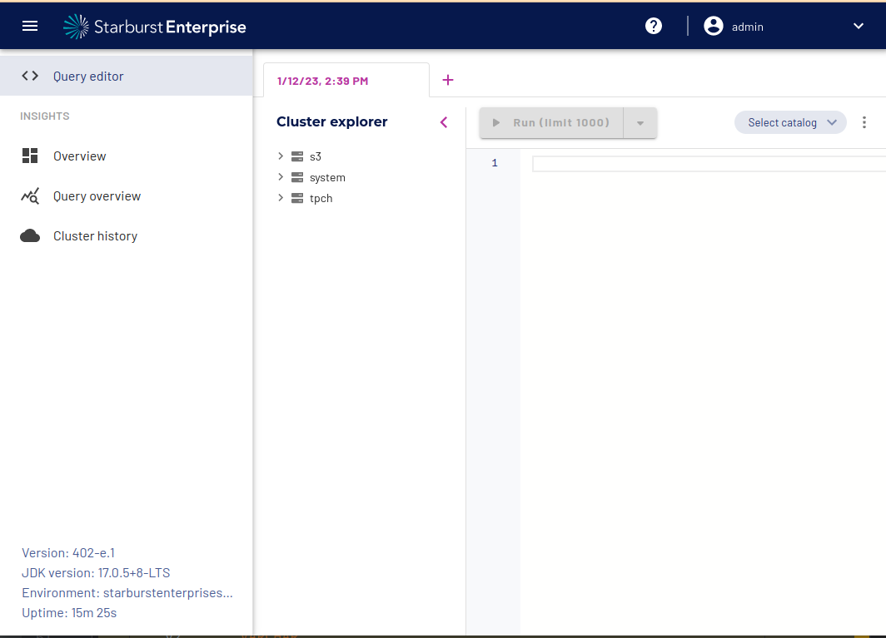
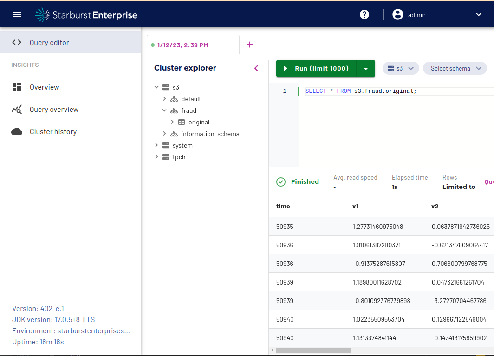
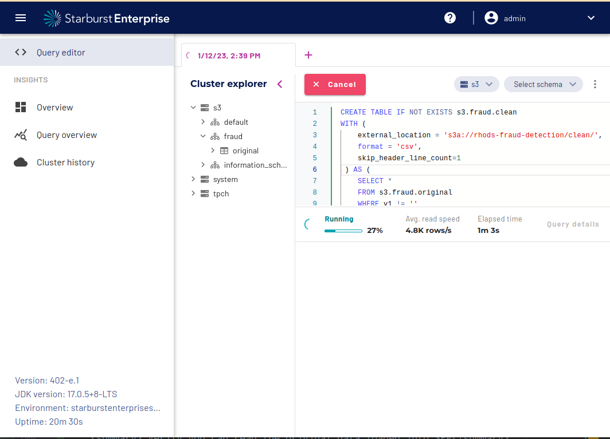
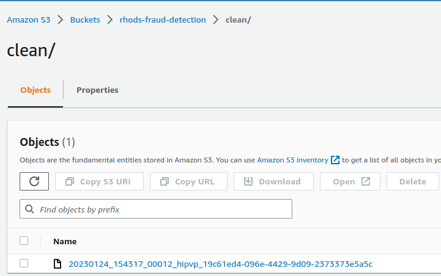

# Fraud detection in RHODS using Starbust Enterprise

##### Requirements:

- RHODS working cluster with administrator access
- Startbust Enterprise licence
- Write access to your own Amazon S3 bucket
- Access to the [original dataset](https://drive.google.com/file/d/1YhmV3vPbFe-JXU_biwvaizV0WGhAegH1/view)

#### What is Trino and Starbust Enterprise?

Trino (formerly Presto® SQL) is the fastest open source, massively parallel
processing SQL query engine designed for analytics of large datasets distributed
over one or more data sources in object storage, databases and other systems.

Starburst Enterprise platform (SEP) is a fully supported, enterprise-grade
distribution of Trino. It adds integrations, improves performance, provides
security, and makes it easy to deploy, configure and manage your clusters.

### Goal

In this document we will cover how to work with the data of the fraud-detection
example with SQL-like queries and an instance of SEP running in the Red Hat
Openshift Data Science cluster.

### Steps

#### Store the original data in S3

Upload the
file [creditcard_with_empty_values.csv](https://drive.google.com/file/d/1YhmV3vPbFe-JXU_biwvaizV0WGhAegH1/view)
to a bucket called `<PASTE_HERE_YOUR_BUCKET_NAME>/data`. In this example, we will name it `rhods-fraud-detection`.
Your AWS credentials **must** have read and write access to this bucket.

#### Set credentials and configure Starbust Enterprise


1. Go to the configs directory `cd ./configs`
2. Update the [01_starbust_licence.yaml](configs/01_starbust_licence.yaml) file with your own Startbust Enterprise license. 
3. Update the [02_aws_credentials.yaml](configs/02_aws_credentials.yaml) file with your own Amazon credentials.
4. Apply the configuration files `cat *.yaml | oc apply -f -`

<details>
    <summary>Expected output</summary>

```bash
$: cat *.yaml | oc apply -f -
secret/starburstdata created
secret/aws-credentials created
starburstenterprise.charts.starburstdata.com/starburstenterprise created
starbursthive.charts.starburstdata.com/starbursthive created
route.route.openshift.io/starbust-web created
```

</details>

#### Working from the SEP WebUI

Log into the Web console of your Starbust Enterprise instance. After exposing it
with a route, it should be available through the URL `http://starbust-web.<cluster_url>/ui/insights/ide`
and the configured credentials (`default user: admin`).

At this point, you should see the query editor in the web ui



#### Create the schema

```sql
CREATE SCHEMA s3.fraud WITH (location = 's3://rhods-fraud-detection/data');
```

#### Queries to read and write using Starbust Enterprise

<details>
    <summary>Create a table reading the original dataset from S3</summary>

```SQL
CREATE TABLE IF NOT EXISTS s3.fraud.original
(
    time     VARCHAR,
    v1       VARCHAR,
    v2       VARCHAR,
    v3       VARCHAR,
    v4       VARCHAR,
    v5       VARCHAR,
    v6       VARCHAR,
    v7       VARCHAR,
    v8       VARCHAR,
    v9       VARCHAR,
    v10      VARCHAR,
    v11      VARCHAR,
    v12      VARCHAR,
    v13      VARCHAR,
    v14      VARCHAR,
    v15      VARCHAR,
    v16      VARCHAR,
    v17      VARCHAR,
    v18      VARCHAR,
    v19      VARCHAR,
    v20      VARCHAR,
    v21      VARCHAR,
    v22      VARCHAR,
    v23      VARCHAR,
    v24      VARCHAR,
    v25      VARCHAR,
    v26      VARCHAR,
    v27      VARCHAR,
    v28      VARCHAR,
    amount   VARCHAR,
    class VARCHAR
) WITH ( 
    external_location = 's3a://rhods-fraud-detection/data/',
    skip_header_line_count = 1,
    format = 'csv'
);
```

</details>
<br/>
<details>
    <summary> Verify you can read the original data loaded into SEP</summary>

```sql
SELECT * FROM s3.fraud.original;
```



</details>
<br/>
<details>
    <summary>Create a second table with only the filtered rows</summary>

```SQL
CREATE TABLE IF NOT EXISTS s3.fraud.clean
    WITH (
        external_location = 's3a://rhods-fraud-detection/clean/',
        format = 'csv',
        skip_header_line_count=1
        ) AS (
    SELECT *
    FROM s3.fraud.original
    WHERE v1 != ''
    AND v2 != ''
    AND v3 != ''
    AND v4 != ''
    AND v5 != ''
    AND v6 != ''
    AND v7 != ''
    AND v8 != ''
    AND v9 != ''
    AND v10 != ''
    AND v11 != ''
    AND v12 != ''
    AND v13 != ''
    AND v14 != ''
    AND v15 != ''
    AND v16 != ''
    AND v17 != ''
    AND v18 != ''
    AND v19 != ''
    AND v20 != ''
    AND v21 != ''
    AND v22 != ''
    AND v23 != ''
    AND v24 != ''
    AND v25 != ''
    AND v26 != ''
    AND v27 != ''
    AND v28 != ''
    AND amount != ''
    AND class != '');
```



> **Note:** This query might take some minutes depending on the network between
> RHODS and the AWS S3 bucket.

</details>

**Result:** Now you can verify that the S3 bucket `rhods-fraud-detection/clean`, 
contains a new file with fewer rows than the original source. **Please, copy the
filename because it will be required to continue in the JupyterHub notebook.**



#### Go back to the [Notebook.ipynb](Notebook.ipynb) and continue with the process.
