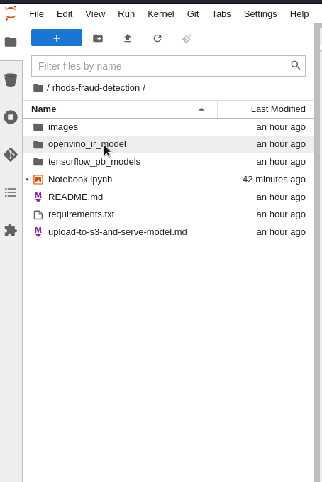
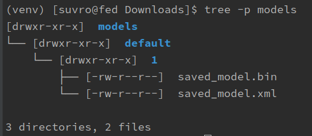
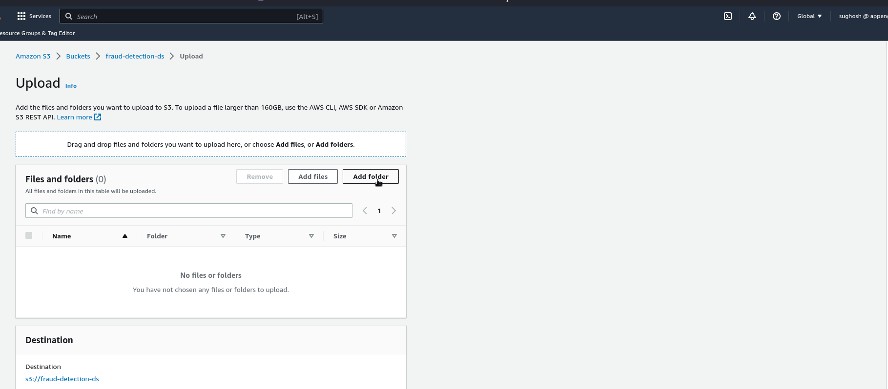
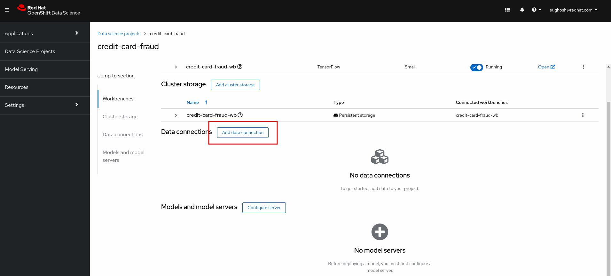
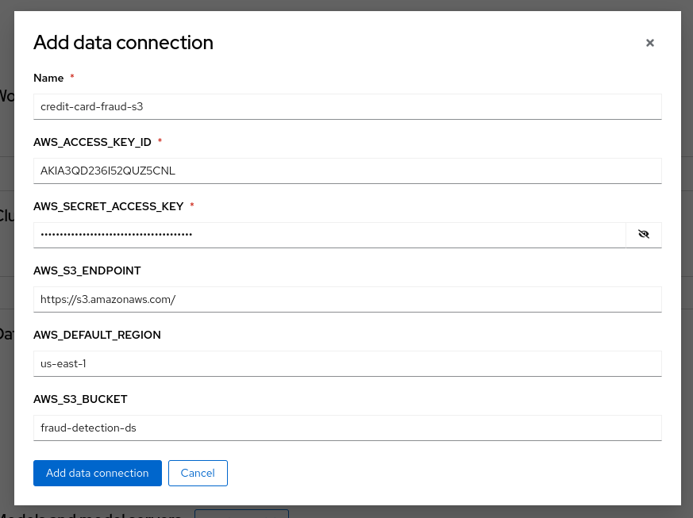
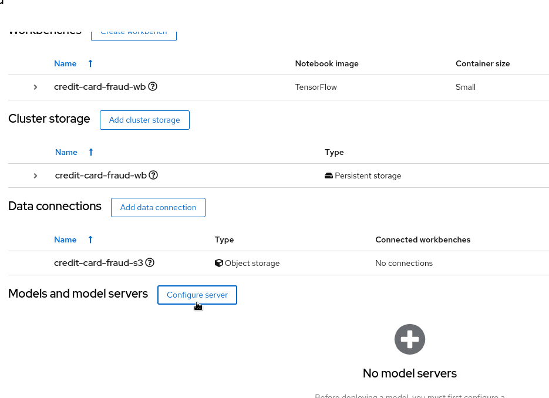
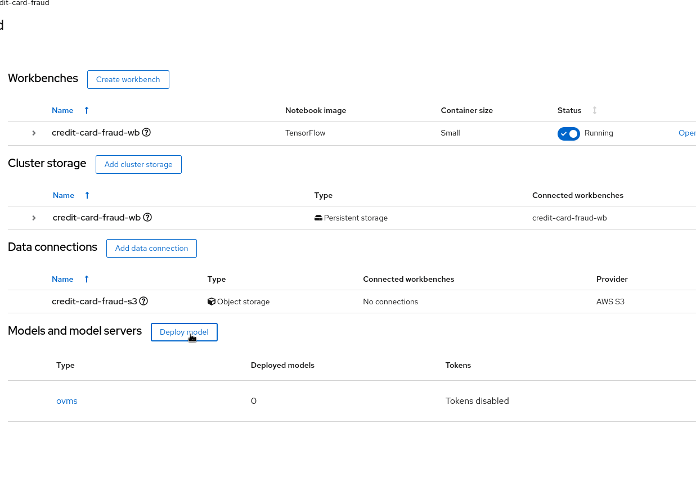

### Prerequisite

- S3 bucket
- RHODS cluster/sandbox

### Step 1: Download the openvino IR files
Download the files from your Notebook's file explorer to your local.

Organise the downloaded files as shown below which is in accordance with guidelines of [openvino model repository](https://github.com/openvinotoolkit/model_server/blob/main/docs/models_repository.md#preparing-a-model-repository-ovms_docs_models_repository)

### Step 2: Upload the files to your S3 bucket
Use your amazon console to upload files to your bucket.

### Step 3: Create Data connections, configure server and deploy the model
<ol type="a">
<li>Head over to your RHODS ODS dashboard to your Datascience project.</li>

click _Add data connection_ 

Configure the data connection with respective values and click _Add data connection_ 

<li>Next configure the server and **make sure** to make the route accessible externally.</li>

Click _Configure_ 

<li>Deploy the model to be served</li>

Click _Deploy_ 

Copy the inference link and head back to the [Notebook.ipynb](Notebook.ipynb)
</ol>